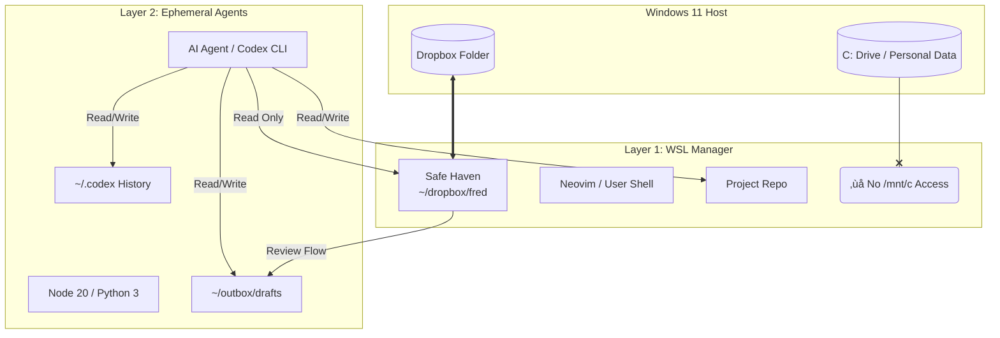

> **Historical raw transcript.** Not maintained. May be outdated, and may contain internal tool artifacts.
> Canonical docs: `docs/getting-started.md`, `README.md`.

---

# Technical Specification: "The Airlock" Architecture

> Historical ChatGPT transcript kept for context. This file is not maintained; see `docs/getting-started.md` for current usage.

Below is a comprehensive technical specification for your **Secure AI Development Environment ("The Airlock")**.

This document outlines the architecture, configuration, and operational scripts required to implement a "Data Diode" workflow using WSL and Docker.

---

## 1. Executive Summary

This project implements a secure, compartmentalized development environment for AI-assisted coding. It solves the tension between **Agent Autonomy** (giving AI tools full access to run code/install packages) and **System Security** (protecting the host OS and personal data).

**Core Philosophy:**

* **WSL as the Manager:** A hardened, consistent environment for the Human (Neovim, Git review).
* **Docker as the Sandbox:** An ephemeral, high-permission environment for the AI Agent (Codex/OpenCode).
* **Dropbox as the Bridge:** A strict, file-system-level interface for passing data between contexts.

## 2. System Architecture

The system is composed of three distinct layers of isolation.

```mermaid
graph TD
    subgraph Windows_Host [Windows 11 Host]
        C_Drive[(C: Drive / Personal Data)]
        Dropbox[(Dropbox Folder)]
    end

    subgraph WSL_Layer [Layer 1: WSL Manager]
        direction TB
        SafeHaven[Safe Haven<br/>(~/dropbox/fred)]
        Neovim[Neovim / User Shell]

        %% Security Barrier
        NoMount(‚ùå No /mnt/c Access)
    end

    subgraph Container_Layer [Layer 2: Ephemeral Agent]
        Agent[AI Agent / Codex CLI]
        Runtime[Node 20 / Python 3]

        %% Permissions
        Agent -- Read/Write --> ProjectFiles[Active Project]
        Agent -- Read Only --> SafeHaven
        Agent -- Read/Write --> Drafts[~/outbox/drafts]
    end

    %% Connections
    Dropbox <==> SafeHaven
    C_Drive --x NoMount
    SafeHaven -- Review Flow --> Drafts

```

## 3. Host Configuration (WSL Hardening)

This phase removes the default insecurity of WSL (broad access to C:) and re-establishes a narrow bridge only to the Dropbox folder.

### 3.1. Disable Automount

**File:** `/etc/wsl.conf`
**Purpose:** prevent WSL from automatically mounting the Windows C: drive.

```ini
[automount]
enabled = false
mountFsTab = true

```

### 3.2. Configure The Bridge

**File:** `/etc/fstab`
**Purpose:** Explicitly mount only the Dropbox folder into the Linux home directory.
*Replace `YourWinUser` with your Windows username.*

```text
# <Source>                              <Target>               <Type>  <Options>
C:\Users\YourWinUser\Dropbox            /home/fred/dropbox     drvfs   defaults,uid=1000,gid=1000,metadata 0 0

```

**Requirements:**

* Apply changes: `wsl --shutdown`

---

## 4. Container Configuration (The Agent Image)

This defines the "Polyglot" environment where the AI operates. It is built on Node 20 (for MV3/TS support) but includes Python 3 and Zsh to match the host workflow.

**File:** `~/agent.Dockerfile`

```dockerfile
# Base: Node 20 (Bookworm) - Best for TypeScript/MV3 dev
FROM node:20-bookworm

# 1. Environment Setup
ENV DEBIAN_FRONTEND=noninteractive
ENV PYTHONDONTWRITEBYTECODE=1

# 2. Install Dependencies (Python, Zsh, Git, Zip)
RUN apt-get update && apt-get install -y \
    python3 \
    python3-pip \
    python3-venv \
    zsh \
    git \
    curl \
    zip \
    vim \
    && rm -rf /var/lib/apt/lists/*

# 3. Install Global Node Tools (TS, Vite, Webpack)
RUN npm install -g \
    typescript \
    ts-node \
    nodemon \
    yarn \
    pnpm

# 4. Install AI CLI Tools (OpenCode / Codex)
# Note: Adjust package name if using a specific private wheel or binary
RUN pip3 install --no-cache-dir --break-system-packages opencode-ai

# 5. User Configuration
# We reuse the standard 'node' user (UID 1000) to match WSL default user.
# We grant it access to a "workspace" directory.
RUN mkdir -p /work && chown -R node:node /work

# 6. Shell Config
SHELL ["/bin/zsh", "-c"]
ENTRYPOINT ["/bin/zsh"]

```

**Build Command:**

```bash
docker build -t my-agent -f ~/agent.Dockerfile .

```

---

## 5. Operational Tooling (The Launcher)

The `yolo` script creates the ephemeral container. It handles the complexity of mapping UIDs (so Neovim permissions don't break) and injecting authentication.

**File:** `~/bin/yolo` (Ensure `chmod +x`)

```bash
#!/bin/bash

# ==========================================
# CONFIGURATION
# ==========================================
SAFE_HAVEN="$HOME/dropbox/fred"             # Read-Only Context (ZK/Journal)
DROPBOX_OUTBOX="$SAFE_HAVEN/outbox/drafts"  # Write-Allowed Output
HOST_AUTH_DIR="$HOME/.codex"                # AI Credentials
IMAGE="my-agent"                            # The Docker image built above

# Get Current Context
CURRENT_PROJECT_DIR=$(pwd)
PROJECT_NAME=$(basename "$CURRENT_PROJECT_DIR")

# User ID Matching (Critical for Neovim compatibility)
USER_ID=$(id -u)
GROUP_ID=$(id -g)

# ==========================================
# EXECUTION
# ==========================================
echo "--- üöÄ LAUNCHING AIRLOCKED AGENT ---"
echo "📂 Project: $PROJECT_NAME (Read-Write)"
echo "👤 User:    UID $USER_ID (Synced with Host)"
echo "-------------------------------------"

docker run -it --rm \
    --network host \
    \
    `# --- 1. IDENTITY & PERMISSIONS ---` \
    -u "$USER_ID:$GROUP_ID" \
    -e HOME=/home/node \
    \
    `# --- 2. ACTIVE WORKSPACE ---` \
    -v "$CURRENT_PROJECT_DIR":/work:rw \
    -w /work \
    \
    `# --- 3. DATA DIODES (Context & Drafts) ---` \
    -v "$SAFE_HAVEN":/context:ro \
    -v "$DROPBOX_OUTBOX":/drafts:rw \
    \
    `# --- 4. AUTHENTICATION ---` \
    -v "$HOST_AUTH_DIR":/home/node/.codex:ro \
    \
    `# --- 5. DOTFILES SYNC (Shell & Git) ---` \
    -v "$HOME/.zshrc":/home/node/.zshrc:ro \
    -v "$HOME/.gitconfig":/home/node/.gitconfig:ro \
    \
    "$IMAGE"

```

---

## 6. Security Model & Risk Analysis

### What is Protected (The Safe Zone)

* **Windows Personal Data:** Completely inaccessible. The container cannot see `/mnt/c`. Even if the AI runs `rm -rf /`, Windows files are safe.
* **Zettelkasten / Archives:** Mounted as **Read-Only (`:ro`)**. The AI can read your history for context but cannot alter or delete it.
* **Host System:** The container is ephemeral. Malicious package installations die with the container.

### What is Exposed (The Hot Zone)

* **Active Project Folder:** The directory you launch `yolo` from is mounted Read-Write. The AI *can* delete files here.
* *Mitigation:* This folder is on WSL. **Git** is the safety net. Always commit before launching the agent.

* **Drafts Folder:** The AI can write to `~/outbox/drafts`.
* *Mitigation:* This is a "quarantine" zone. You must manually review and move files from here to your permanent storage.

### Known Limitations

1. **IO Performance:** Files in `/work` (WSL native) are fast. Files in `/context` (Dropbox mount) will be slower due to the 9P protocol bridge.
2. **Global NPM/Pip:** If the agent installs *global* packages (`npm -g`), they vanish on exit. This is a feature, not a bug. Project dependencies (`package.json`) persist.

---

please review for soundness, validity, accuracy, precision, necessity, and sufficiency?
my intent is to use this as the next step in my ai agent assisted dev workflow on my windows device with WSL.

(not a hill to die on at this stage, but a note on where we're reinventing the wheel will be appreciated, without getting into analysis paralysis or tool acquisition syndrome)

ChatGPT:

|
You’re very close to something solid: “least‑privilege by mount”, human-in-WSL, agent-in-container, and a narrow filesystem bridge. The overall shape is sound.

Where it bites (and where the “data diode” story can quietly fail) is mostly in a couple of Linux filesystem semantics + a few practical Docker/WSL gotchas.

## Soundness & validity

### What’s sound

- Isolation by default via mount discipline is the right lever. If the agent can’t see your personal filesystem, it can’t delete it (or “helpfully refactor” it into oblivion).
- WSL-native project storage (/work on ext4) is the right move for speed + fewer Windows/9P weirdness.
- Ephemeral container + “everything important persists via Git + explicit output folder” is a good operational contract.

### What’s not fully valid as stated

- “Read-only Safe Haven” is not automatically a hard boundary if you also give the container any writable foothold on the same underlying filesystem as the safe haven. Your current design does exactly that (details below).
- Docker is not a security boundary in the strong sense. It’s excellent for workflow containment and reducing “oops” blast radius, but it doesn’t equal “hostile code can’t ever break out.” For your intent (AI agent autonomy without nuking your machine), it’s still a pragmatic win.

## Critical issue: your RO context can be bypassed

### The problem

You mount:

- `SAFE_HAVEN` ‚Üí `/context:ro`
- `SAFE_HAVEN/outbox/drafts` ‚Üí `/drafts:rw`

Both paths live under the same Windows Dropbox mount (DrvFS). That creates a classic bypass:

Hardlink escape.
Inside the container, the agent can hardlink a file from `/context/...` into `/drafts/...` (which is writable), then edit it via the hardlink. Result: the original “read-only” context file changes.

Example of the attack shape (not exotic; it’s one command):

```bash
ln /context/notes/precious.md /drafts/precious.md   # hard link
echo "pwned" >> /drafts/precious.md                 # modifies the original inode
```

Whether this works depends on filesystem + kernel settings, but on “normal Linux semantics” it’s a known footgun, and NTFS/DrvFS often supports hardlinks.

### The fix (minimal + robust)

Do not place the agent-writable outbox on the same filesystem as the RO context.

Practical options, ordered by simplicity:

1. Best: drafts on WSL ext4, not inside Dropbox.
 - `SAFE_HAVEN` stays in Dropbox (Windows-mounted) and is RO to the agent.
 - `DRAFTS` lives in WSL native storage (fast) and is RW to the agent.
 - After review, you copy selected outputs into Dropbox.

2. Alternative: run the agent as a different UID than the safe haven’s owner, and rely on `fs.protected_hardlinks=1` style protections + permissions.
 This gets fiddly fast (ownership/umask/ACLs) and breaks your “keep-id” niceness.

If you want “data diode” to mean what it says, option (1) is the clean move.

## Accuracy & precision audit

### WSL hardening

‚úÖ Good: disabling automount reduces accidental exposure of `/mnt/c`.

Add this if you want to reduce “escape via Windows interop”:

```ini
[interop]
enabled = false
appendWindowsPath = false
```

Why: if something ever compromises the WSL side (or you accidentally run something), interop makes it easy to invoke Windows binaries. Turning it off narrows weird cross‚ÄëOS affordances.

fstab entry: broadly fine, but tighten the “bridge” exposure:

- If your Dropbox contains anything you wouldn’t want the agent to read, don’t mount all of Dropbox.
- Mount a dedicated folder instead, e.g. `...\Dropbox\AirlockContext` ‚Üí `/home/fred/dropbox`.

Also make sure:

- `/home/fred/dropbox` exists before boot
- you test with `sudo mount -a` inside WSL before doing the shutdown/restart loop

### Dockerfile

Small accuracy nit: you say “Vite/Webpack” but don’t install them. Either install them or remove the mention.

Practical sufficiency nit: for real-world JS/Python projects you’ll often need build tooling:

- `build-essential`, `ca-certificates`, sometimes `pkg-config`, `libssl-dev`, etc.

Also: `--break-system-packages` is fine for an ephemeral image, but it’s a bit “Debian, I know what I’m doing, don’t @ me.” If you want a cleaner pattern:

- install the agent CLI into a venv (even if global), or use `pipx`. Not mandatory, just cleaner.

### `yolo` launcher script

The backticks-for-comments are a weird hack. They usually evaluate to an empty string, but it’s brittle and unnecessary. Replace them with normal `#` comments.

Also add:

- `set -euo pipefail`
- ensure draft directory exists before docker run (and owned by you), so Docker doesn’t create it as root
- optional preflight: refuse to run if git repo is dirty unless you override

## Necessity & sufficiency

### What’s necessary (and you’ve got it)

- Separate execution context (container) ‚úÖ
- Explicitly bounded file access (bind mounts) ‚úÖ
- Human review choke-point (drafts) ‚úÖ
- Fast workspace (WSL ext4 project) ‚úÖ

### What’s missing for “sufficient” (in the security sense)

- Fix the RO context bypass (outbox must not share FS with context) ‚ùå
 This is the one change I’d treat as non-negotiable if you care about the “RO history” claim.

### What’s missing for “sufficient” (in the operational sense)

- Preflight guardrails: “commit or stash before launch”, “ensure drafts dir exists”, etc.
- Resource limits (optional): prevent runaway installs/tests from chewing your laptop.

## Concrete patch: minimal changes that materially improve the design

### 1) Move drafts off Dropbox (WSL-native)

Change:

```bash
DROPBOX_OUTBOX="$SAFE_HAVEN/outbox/drafts"
```

To something like:

```bash
DRAFTS_BASE="$HOME/.airlock-outbox"     # WSL ext4
DRAFTS_DIR="$DRAFTS_BASE/drafts"
```

### 2) Cleaned-up launcher (drop-in)

```bash
#!/usr/bin/env bash
set -euo pipefail

SAFE_HAVEN="$HOME/dropbox/fred"          # Context you allow the agent to read
DRAFTS_BASE="$HOME/.airlock-outbox"      # WSL-native, NOT inside SAFE_HAVEN
DRAFTS_DIR="$DRAFTS_BASE/drafts"

HOST_AUTH_DIR="$HOME/.codex"
IMAGE="my-agent"

CURRENT_PROJECT_DIR="$(pwd)"
PROJECT_NAME="$(basename "$CURRENT_PROJECT_DIR")"

USER_ID="$(id -u)"
GROUP_ID="$(id -g)"

mkdir -p "$DRAFTS_DIR"

echo "--- üöÄ LAUNCHING AIRLOCKED AGENT ---"
echo "📂 Project: $PROJECT_NAME (Read-Write)"
echo "üìö Context: $SAFE_HAVEN (Read-Only)"
echo "📤 Drafts:  $DRAFTS_DIR (Read-Write, WSL-native)"
echo "-------------------------------------"

docker run -it --rm \
  --name "airlock-$PROJECT_NAME" \
  -u "$USER_ID:$GROUP_ID" \
  -e HOME=/home/node \
  -v "$CURRENT_PROJECT_DIR":/work:rw \
  -w /work \
  -v "$SAFE_HAVEN":/context:ro \
  -v "$DRAFTS_DIR":/drafts:rw \
  -v "$HOST_AUTH_DIR":/home/node/.codex:ro \
  -v "$HOME/.zshrc":/home/node/.zshrc:ro \
  -v "$HOME/.gitconfig":/home/node/.gitconfig:ro \
  "$IMAGE"
```

### 3) Consider dropping `--network host`

Unless you need host networking (rare), remove it. Default bridge networking is usually enough and shrinks the “agent can poke local services” surface.

If you do need localhost access to host services, you can solve that without host networking (e.g., `host.docker.internal` depending on setup), but don’t overcomplicate yet—just remove host networking until you miss it.

### 4) Dotfiles: tighten the leak surface

Mounting your real `.zshrc` is convenient, but it’s also a secret/config exfiltration buffet and can run a bunch of side-effect-y startup code.

Two low-friction improvements:

- create `~/.airlock/zshrc` that’s minimal and mount that instead
- same for `.gitconfig` (especially if it references credential helpers)

## “Are we reinventing the wheel?”

A bit, but in the good way: you’re basically building a manual devcontainer + controlled bind mounts + review gate.

Existing “wheel segments” you’re approximating:

- Devcontainers: standard way to define the containerized dev env; your Dockerfile is already most of it.
- Git worktree / patch workflows: common “agent works in a scratch branch/worktree, human reviews diff” pattern.
- CI-like hermeticism: ephemeral environment, explicit inputs/outputs.

You don’t need to adopt new tools to get the value—just recognize you’re in that family so you can steal idioms (patches, worktrees, devcontainer.json) when it’s worth it.

## Bottom line

- Architecture: coherent and useful.
- Biggest flaw: RO context can be bypassed because drafts are RW on the same underlying filesystem as the context.
- Minimal fix: make drafts live on WSL ext4; copy reviewed artifacts into Dropbox later.
- Next biggest tweaks: kill host networking unless needed; sanitize dotfiles; add preflight checks.

If you want, I can also give you a tiny “self-test checklist” (commands you run once) to prove to yourself that `/context` is truly immutable from inside the container after the outbox move.


You:
while you were reviewing we made some further edits, finished prior to you feedback.

---
Here is the comprehensive Technical Specification for **"The Airlock" Architecture**.

This document defines a compartmentalized development environment designed to balance **Agent Autonomy** (unrestricted execution) with **System Security** (host isolation) and **Workflow Continuity** (Neovim/Git integration).

---

# Technical Specification: "The Airlock" Architecture

## 1. Executive Summary

"The Airlock" creates a "Data Diode" workflow using WSL and Docker. It physically separates the **Manager Environment** (WSL/Human) from the **Execution Environment** (Docker/AI).

* **The Safe Haven (WSL):** A hardened environment with no access to the Windows host file system (`/mnt/c` disabled). Used for code review, version control (Git), and editing (Neovim).
* **The Hot Zone (Docker):** Ephemeral containers where AI agents run with elevated permissions ("Yolo Mode"), restricted to specific project directories and unable to compromise the host OS.
* **The Bridge (Dropbox):** A strictly defined interface for passing context (Zettelkasten) and retrieving artifacts (Drafts).

## 2. System Architecture

The system enforces isolation through three distinct layers.



---

## 3. Host Configuration (WSL Hardening)

This phase removes the default WSL vulnerability (broad C: drive access) and re-establishes a narrow, controlled bridge.

### 3.1. Disable Automount

**File:** `/etc/wsl.conf`
**Purpose:** Prevent WSL from automatically mounting the Windows C: drive, protecting personal data from rogue `rm -rf` commands.

```ini
[automount]
enabled = false
mountFsTab = true

```

### 3.2. Configure The Bridge

**File:** `/etc/fstab`
**Purpose:** Explicitly mount *only* the Dropbox folder into the Linux home directory.
*Note: Replace `YourWinUser` with your actual Windows username.*

```text
# <Source>                              <Target>               <Type>  <Options>
C:\Users\YourWinUser\Dropbox            /home/fred/dropbox     drvfs   defaults,uid=1000,gid=1000,metadata 0 0

```

---

## 4. Container Configuration (The Image)

The "Polyglot" image provides the runtime environment for the AI. It mirrors the host's capabilities (Node, Python, Zsh) to ensure tooling compatibility.

**File:** `~/agent.Dockerfile`

```dockerfile
# Base: Node 20 (Bookworm) - Optimized for TypeScript/MV3 dev
FROM node:20-bookworm

# 1. Environment Setup
ENV DEBIAN_FRONTEND=noninteractive
ENV PYTHONDONTWRITEBYTECODE=1

# 2. Install Dependencies (Python, Zsh, Git, Zip)
RUN apt-get update && apt-get install -y \
    python3 \
    python3-pip \
    python3-venv \
    zsh \
    git \
    curl \
    zip \
    vim \
    && rm -rf /var/lib/apt/lists/*

# 3. Install Global Node Tools
RUN npm install -g typescript ts-node nodemon yarn pnpm

# 4. Install AI CLI Tools
# (Adjust 'opencode-ai' to the specific binary/package name)
RUN pip3 install --no-cache-dir --break-system-packages opencode-ai

# 5. User Configuration
# Reuse standard 'node' user (UID 1000) to match WSL default user
RUN mkdir -p /work && chown -R node:node /work

# 6. Shell Config
SHELL ["/bin/zsh", "-c"]
ENTRYPOINT ["/bin/zsh"]

```

**Build Command:**

```bash
docker build -t my-agent -f ~/agent.Dockerfile .

```

---

## 5. Agent Configuration (The Policy)

Inside the container, the AI operates in "Autonomous Mode." We inject a configuration file that disables the human-approval guardrails, as the container *is* the guardrail.

**File:** `~/agent-codex-config.json` (on WSL Host)

```json
{
  "sandbox": {
    "mode": "permissive",
    "fs": { "scope": ["workspace"], "read_only": false },
    "network": { "allow_outbound": true }
  },
  "guardrails": {
    "require_approval": {
      "file_edits": false,
      "shell_commands": false,
      "network_requests": false
    },
    "confirmation_mode": "notification_only"
  },
  "telemetry": false
}

```

---

## 6. Operational Tooling (The Launcher)

The `yolo` script orchestrates the environment. It handles UID mapping, path mirroring, caching, and config injection.

**File:** `~/bin/yolo` (Ensure `chmod +x`)

```bash
#!/bin/bash

# --- CONSTANTS ---
SAFE_HAVEN="$HOME/dropbox/fred"
DROPBOX_OUTBOX="$SAFE_HAVEN/outbox/drafts"
HOST_CODEX_DIR="$HOME/.codex"
IMAGE="my-agent"

# --- DYNAMIC CONFIG ---
# Mirror Mount Strategy: Map host PWD to exact same path in container
WORK_DIR=$(pwd)
USER_ID=$(id -u)
GROUP_ID=$(id -g)

# --- CACHE PREPARATION ---
# Ensure directories exist on host so Docker doesn't create them as Root
DIRS_TO_CACHE=( "$HOME/.npm" "$HOME/.cache" "$HOME/.local/share/pnpm" "$HOST_CODEX_DIR" )
for dir in "${DIRS_TO_CACHE[@]}"; do
    [ ! -d "$dir" ] && mkdir -p "$dir"
done

echo "--- üöÄ LAUNCHING AIRLOCKED AGENT ---"
echo "📂 Path: $WORK_DIR (Mirrored)"
echo "------------------------------------"

docker run -it --rm \
    --network host \
    \
    `# 1. IDENTITY` \
    -u "$USER_ID:$GROUP_ID" \
    -e HOME=/home/node \
    \
    `# 2. MIRROR MOUNT (Project Files)` \
    -v "$WORK_DIR":"$WORK_DIR":rw \
    -w "$WORK_DIR" \
    \
    `# 3. COGNITIVE PERSISTENCE (Auth + History)` \
    -v "$HOST_CODEX_DIR":/home/node/.codex:rw \
    \
    `# 4. PASSTHROUGH CACHING (Speed)` \
    -v "$HOME/.npm":/home/node/.npm:rw \
    -v "$HOME/.cache":/home/node/.cache:rw \
    -v "$HOME/.local/share/pnpm":/home/node/.local/share/pnpm:rw \
    \
    `# 5. DATA DIODES (Context & Drafts)` \
    -v "$SAFE_HAVEN":/context:ro \
    -v "$DROPBOX_OUTBOX":/drafts:rw \
    \
    `# 6. CONFIG INJECTION (Yolo Mode)` \
    -v "$HOME/agent-codex-config.json":/home/node/.codex/config.json:ro \
    \
    `# 7. SHELL SYNC` \
    -v "$HOME/.zshrc":/home/node/.zshrc:ro \
    -v "$HOME/.gitconfig":/home/node/.gitconfig:ro \
    \
    "$IMAGE"

```

---

## 7. Data Persistence & Performance Model

### 7.1. Passthrough Caching

To minimize container "cold start" latency, package manager caches are mapped directly to the WSL host.

* **NPM:** `~/.npm` (Host) ‚Üî `~/.npm` (Container)
* **PIP:** `~/.cache` (Host) ‚Üî `~/.cache` (Container)

### 7.2. Cognitive Persistence (History)

To enable session search (CASS) and token refreshing, the agent's state directory is persisted.

* **Path:** `~/.codex` (Host) ‚Üî `~/.codex` (Container)
* **Permission:** Read/Write.
* **Benefit:** Session logs generated inside a disposable container are immediately indexed and searchable by tools running on the host.

---

## 8. Workflow & Concurrency

### 8.1. The "Collision Model"

We enable parallel agent workflows without complex Git Worktrees by utilizing the shared file system.

* **Scenario:** Agent A (Pane 1) works on `/frontend`; Agent B (Pane 2) works on `/backend`.
* **Mechanism:** Both containers mount the same physical host directory. Changes made by Agent A are instantly visible to Agent B (and the User).
* **Conflict Resolution:** The User (in WSL/Neovim) acts as the "Traffic Controller," managing Git commits and resolving logic conflicts.

### 8.2. Neovim Integration

* **Permissions:** Because containers run with `-u 1000:1000`, files created by the agent (`npm install`, new components) are owned by the User.
* **LSP:** Neovim's LSP (running on WSL) can read `node_modules` generated by the container without permission errors.

## 9. Security Model

| Zone | Permission | Status |
| --- | --- | --- |
| **Windows C: Drive** | **None** | Completely inaccessible (Config-level block). |
| **Zettelkasten** | **Read Only** | Agent can read context but cannot corrupt history. |
| **Drafts Folder** | **Read Write** | Designated "drop zone" for agent artifacts. |
| **Project Source** | **Read Write** | Agent has full control. **Mitigation:** Git (Reset/Revert). |
---

please re-review in full?

ChatGPT:

|
Alright — full re-review, with the updated spec as the source of truth.

Net: the shape is still good, but this v2 introduces (1) a couple of correctness/accuracy bugs (Codex/OpenCode config + install mismatch), and (2) one security footgun that still makes the “diode” leaky (context RO bypass via same-filesystem RW outbox). Plus a (3) “your claims are too absolute” issue around Docker Desktop’s real-world escape history.

## 0. High-level verdict

### Sound

- WSL as the “human manager” + Docker as the “agent executor” is a sane division of labour.
- Disabling WSL automount then re‚Äëmounting a single Windows folder via `/etc/fstab` is the right idea.
- UID/GID mapping and keeping project files on WSL ext4 keeps Neovim/Git ergonomics intact.

### Not sound as written

1. Your “RO Safe Haven” is still bypassable because drafts live under the same Dropbox/DrvFS filesystem as the RO context. This is the big one. (Hardlink trick = RO turns into “lol nope”.)

2. You’re mixing tooling ecosystems:
 - Dockerfile installs `opencode-ai` via pip (which appears to be a Python API library), while the spec narrative is “Codex CLI” and you inject a `.codex` config as JSON. Those don’t line up with either OpenAI Codex CLI or OpenCode’s documented config formats/paths.

3. Security claims are too absolute. Docker Desktop has had a critical vuln (CVE‑2025‑9074) where a malicious container could access the Docker Engine API and then get at host files; fixed in 4.44.3; ECI didn’t mitigate. Your model should explicitly assume “update cadence matters.”

If you fix (1) + (2), this becomes “good enough to be useful without self‑delusion”.

---

## 1. Executive summary & “Data Diode” precision

### Terminology: “data diode”

Right now it’s not a diode; it’s two explicit one-way lanes:

- `/context` is “read lane”
- `/drafts` is “write lane”
 …plus `/work` is full duplex.

That’s fine, just don’t oversell it as physical one-directionality. Call it something like “review-gated promotion pipeline” or “mount-policy diode” if you want the vibe without lying to yourself.

### Dropbox as the bridge

Dropbox is also a network exfil channel by design. If the outbox is inside Dropbox, artifacts can sync off-box before human review. That may be okay, but then your “quarantine” story is inaccurate unless you disable syncing for that folder or move drafts out of Dropbox.

---

## 2. WSL hardening: mostly correct, one wording fix

### 2.1 `/etc/wsl.conf`

Your config is valid and matches Microsoft’s documented keys.

But the precision fix: `enabled=false` means not automatically mounted, not “impossible.” Microsoft explicitly notes drives won’t be mounted automatically, but can still be mounted manually or via `/etc/fstab`.

So your security table line “Windows C: completely inaccessible” is only true by policy + absence of a mount, not by physics.

Optional hardening that does match the WSL model if you want fewer Windows affordances in the manager layer:

```ini
[interop]
enabled=false
appendWindowsPath=false
```

Those are real documented knobs.

### 2.2 `/etc/fstab`

Mounting Dropbox via DrvFS is normal. Using `metadata` is good because permission masks only apply with metadata enabled.

One necessity/sufficiency check:

- Mounting all of Dropbox is broader than necessary if your “Safe Haven” is only `~/dropbox/fred`. You could mount a narrower Windows folder (e.g., `Dropbox\Airlock`) instead of the entire Dropbox tree. Less accidental exposure.

---

## 3. Container image: coherent base, but tooling mismatch

### Base + deps

`node:20-bookworm` + python3 + zsh + git is fine.

### The mismatch

You install:

```dockerfile
pip3 install ... opencode-ai
```

But:

- OpenCode (the agent) is documented as a separate CLI, installable via their installer script.
- `opencode-ai` looks like “the official Python library for the opencode API” — not the CLI.
 So as written, your image likely does not contain the agent you think it contains (unless you’re deliberately using the Python SDK and calling it yourself).

### Pick one consistent path

Option A — OpenAI Codex CLI

- Install via npm: `npm i -g @openai/codex`.
- Configure via `~/.codex/config.toml`, not JSON.

Option B — OpenCode

- Install OpenCode CLI the way their docs prescribe (script/package manager), and configure via `~/.config/opencode/opencode.json` (or per-project `opencode.json`).

Right now the spec is a chimera: “Codex CLI” language + `.codex` mounts + OpenCode-ish package naming.

---

## 4. “Agent policy” config: currently inaccurate for Codex, and unrelated for OpenCode

### If you mean OpenAI Codex CLI

Your `agent-codex-config.json` is not aligned with OpenAI’s Codex configuration system:

- Codex uses `~/.codex/config.toml` as the user config location.
- Approval is controlled by `approval_policy` (`untrusted | on-failure | on-request | never`).
- “full auto” and sandboxing are primarily flags like `--full-auto`, `--sandbox danger-full-access`, etc.

Also important: OpenAI explicitly notes that Codex’s own sandboxing may not work inside Docker if the container/host doesn’t support Landlock/seccomp the way it expects; they recommend relying on the container for isolation and then running Codex in a “danger-full-access” mode inside it.
That’s basically your philosophy — just do it with the actual Codex config surface.

### If you mean OpenCode

OpenCode’s config lives at `~/.config/opencode/opencode.json` by default (or `opencode.json` per project), and you can override via env vars like `OPENCODE_CONFIG` / `OPENCODE_CONFIG_CONTENT`.
So mounting a file into `/home/node/.codex/config.json` won’t affect OpenCode.

Conclusion: this section fails the accuracy test until you choose the agent.

---

## 5. Launcher (`yolo`): powerful, but contains your biggest security flaw

### 5.1 Good moves

- Pre-creating cache dirs to avoid Docker creating root-owned folders is good ergonomics.
- UID/GID mapping is fine as long as your WSL user is truly the owner of those dirs.

### 5.2 `--network host`

On Docker Desktop, host networking is “a feature,” not a given:

- It’s supported on Docker Desktop 4.34+ and you must enable “Enable host networking” in settings.

Security-wise: host networking enlarges the surface area (agent can poke local services, dev DBs, admin dashboards, etc.). If you don’t need it, drop it. If you do need it, keep it explicit.

### 5.3 The still-lethal “RO context + RW drafts on same FS” issue

You still have:

```bash
SAFE_HAVEN="$HOME/dropbox/fred"
DROPBOX_OUTBOX="$SAFE_HAVEN/outbox/drafts"
-v "$SAFE_HAVEN":/context:ro
-v "$DROPBOX_OUTBOX":/drafts:rw
```

Because both are on the same Dropbox/DrvFS filesystem, your RO boundary can be bypassed (hardlinks are the classic). This is exactly where your “diode” becomes a leaky faucet.

Minimal fix with maximal effect: put drafts on a different filesystem (WSL ext4), then manually promote reviewed artifacts into Dropbox.
Example conceptual change:

- `/context` stays Dropbox-backed and RO
- `/drafts` becomes `~/.airlock-outbox` on WSL ext4 and RW

Bonus: you also stop Dropbox syncing agent outputs before review.

### 5.4 “Ephemeral container” vs “persistent hot state”

You now persist:

- `.codex` RW
- `.npm` RW
- `.cache` RW
- pnpm store RW

That’s fine, but be honest: you’ve created persistent infection surfaces. If the agent ever does something “creative,” it can stash stuff there. It probably won’t brick Windows, but it can absolutely create future weirdness.

If you want the speed without writing into your real `$HOME`, use named Docker volumes for caches. Still persistent, less host coupling.

### 5.5 Backtick-comments

The backticks you’re using to “comment” inside the docker command are a brittle shell trick (they execute). It usually expands to empty, but it’s asking for a stupid failure at 2am. Use normal `#` comments above the `docker run` lines.

---

## 6. Persistence & performance model: good, with one security clarification

### Caches

As above: good for speed, but they’re now part of the “hot zone.” Treat them accordingly.

### “Cognitive persistence”

Persisting history is useful. But your spec currently says “history is immediately indexed and searchable by tools running on the host.”
That’s true if you have such tools, but it also means your host will process untrusted text blobs created by the agent. Not automatically dangerous, just something to explicitly classify as hot-zone data.

---

## 7. Concurrency model: workable, but it’s a race condition by design

Mounting the same repo into multiple containers and letting them both write is basically saying:
“We’re doing eventual consistency with a human as the conflict resolver.”

That’s okay. Just note the real pain points:

- package-lock / pnpm-lock / yarn.lock collisions
- shared generated files
- build/watch processes stepping on each other
- port conflicts (worse with `--network host`)

If you ever get sick of the chaos, git worktrees are the “wheel you’re reinventing,” but you don’t need to adopt that now.

---

## 8. Security model: update 3 claims so they’re true

### 8.1 “Windows C: Drive — None — Completely inaccessible”

More precise version:

- Not automatically mounted (`enabled=false`).
- Still mountable manually or via fstab (you are using fstab).
 So “inaccessible” is a discipline, not an impossibility.

### 8.2 “Zettelkasten — Read Only — cannot corrupt history”

Only true if you fix the drafts placement. As written, the bypass exists.

### 8.3 “Unable to compromise the host OS”

Too absolute. Docker Desktop has had real critical escape-style issues, including CVE‚Äë2025‚Äë9074 where a malicious container could access the Docker Engine and then reach host files; fixed in 4.44.3, and ECI did not mitigate.
Your model should include: keep Docker Desktop updated as a first-class control, not an afterthought.

---

## 9. Minimal set of changes I’d do before trusting this daily

No tool acquisition syndrome — just the high-leverage edits:

1. Move drafts off Dropbox onto WSL ext4 (fixes RO bypass + stops premature Dropbox sync).
2. Pick one agent (OpenAI Codex CLI or OpenCode) and align:
 - install method (`npm i -g @openai/codex` for Codex)
 - config file format/location (Codex: `~/.codex/config.toml`; OpenCode: `~/.config/opencode/opencode.json`)
3. Drop `--network host` by default; add it only when you have a specific reason, and remember it requires enabling in Docker Desktop.
4. Tone down the absolutes in the security table (make it precise, not aspirational).

If you apply just those, you’re in “robust and honest” territory.

If you want, I can rewrite the spec as a cleaned v2.1 (same intent, but internally consistent: one agent toolchain + corrected security model + fixed diode).


You:
yes please. make it so.

ChatGPT:

|
Below is a cleaned, internally-consistent v2.1 of your spec with the big diode leak fixed, one agent toolchain chosen (OpenAI Codex CLI), and the security model made precise (no heroic absolutes).

---

# Technical Specification: “The Airlock” Architecture v2.1 (Codex CLI Edition)

## 1. Executive Summary

The Airlock is a compartmentalized dev workflow for AI-assisted coding on Windows + WSL + Docker.

- Manager Environment (WSL / Human): Neovim, Git, review, merges. WSL is hardened to avoid accidental Windows drive exposure by disabling automatic DrvFS mounts.
- Execution Environment (Docker / AI): an ephemeral container running Codex CLI with high autonomy, constrained by explicit bind mounts.
- Bridge (Dropbox / Context only): read-only context for the agent, mounted into WSL and then into the container as RO.
- Outbox (WSL ext4 / Artifacts): agent writes artifacts into a WSL-native outbox (not inside Dropbox). This prevents “RO bypass” and avoids Dropbox syncing unreviewed outputs.

Design invariant: the agent can’t write to anything you haven’t explicitly mounted RW, and the “history/context” mount is RO without a same-filesystem writable escape hatch.

---

## 2. System Architecture

```mermaid
graph TD
  subgraph Windows_Host [Windows 11 Host]
    CDrive[(C: Personal Data)]
    Dropbox[(Dropbox Folder)]
  end

  subgraph WSL_Manager [Layer 1: WSL Manager]
    direction TB
    Repo[Project Repo<br/>(WSL ext4)]
    SafeHaven[Safe Haven Context<br/>(~/dropbox/fred)]
    Outbox[Airlock Outbox<br/>(~/.airlock/outbox)]
    Human[Neovim / Git]
    NoMount[‚ùå No automatic /mnt/c mounts]
  end

	  subgraph Docker_Agent [Layer 2: Ephemeral Agent Container]
	    Agent[Codex CLI]
	    Runtime[Node / Python toolchain]
	    Agent -- RW --> Repo
	    Agent -- RO --> SafeHaven
	    Agent -- RW --> Outbox
	    Agent -- RW --> Cache[~/.airlock/cache]
	  end

  Dropbox <==> SafeHaven
  CDrive --x NoMount
```

---

## 3. Host Configuration (WSL Hardening)

### 3.1 Disable Windows drive automount

File: `/etc/wsl.conf`
Purpose: prevent automatic mounting of fixed drives under `/mnt` (reduces accidental exposure of Windows paths). Setting `enabled=false` stops automount, but drives can still be mounted manually or via `/etc/fstab` (that’s intentional here).

```ini
[automount]
enabled = false
mountFsTab = true

# Optional: reduce Windows interop affordances
[interop]
enabled = false
appendWindowsPath = false
```

Apply:

```powershell
wsl --shutdown
```

### 3.2 Configure the Bridge: mount only the Safe Haven context

Instead of mounting all Dropbox, mount only the subfolder you intend as context.

File: `/etc/fstab`

```text
# <Source>                                   <Target>                <Type>  <Options>
C:\Users\YourWinUser\Dropbox\fred            /home/fred/dropbox/fred  drvfs   defaults,uid=1000,gid=1000,metadata 0 0
```

Notes:

- `metadata` enables sane Linux permissions on DrvFS mounts; WSL documents how DrvFS + metadata affects uid/gid and permission masks.
- Keep the Safe Haven context-only: no secrets, no keys, nothing you wouldn’t paste into a prompt.

Apply:

```powershell
wsl --shutdown
```

---

## 4. Directory Layout (WSL)

This is the “make the diode real” part.

```text
~/dropbox/fred/                 # Dropbox-backed, context only (RO to agent)
~/.codex/                       # Codex auth/config/history (RW to agent via yolo mount)
~/.airlock/
  cache/                        # npm/pnpm/pip caches (RW to agent)
  outbox/
    drafts/                     # agent writes artifacts here (RW to agent)
  policy/
    zshrc                       # minimal shell init (RO to agent)
```

Why drafts are not in Dropbox: avoids RO-bypass via same-filesystem writable paths and prevents Dropbox from syncing unreviewed artifacts.

---

## 5. Container Configuration (Agent Image)

This image is optimized for JS/TS work (Node base) but includes Python and shell tooling. It installs Codex CLI via npm.

File: `~/agent.Dockerfile`

```dockerfile
FROM node:20-bookworm

ENV DEBIAN_FRONTEND=noninteractive
ENV PYTHONDONTWRITEBYTECODE=1

# OS deps
RUN apt-get update && apt-get install -y \
    python3 python3-pip python3-venv \
    zsh git curl ca-certificates \
    zip unzip vim \
    && rm -rf /var/lib/apt/lists/*

# Common node tooling
RUN npm install -g typescript ts-node nodemon yarn pnpm

# Install Codex CLI (pin if you want repeatability)
# As of 2026-01-15, Codex CLI 0.84.0 is in the OpenAI changelog. You can pin it.
ARG CODEX_VERSION=0.84.0
RUN npm install -g @openai/codex@${CODEX_VERSION}

# Workspace
RUN mkdir -p /work && chown -R node:node /work

SHELL ["/bin/zsh", "-c"]
ENTRYPOINT ["/bin/zsh"]
```

Build:

```bash
docker build -t airlock-agent -f ~/agent.Dockerfile .
```

---

## 6. Codex Configuration

Codex reads config from `~/.codex/config.toml` (or `$CODEX_HOME/config.toml`).

Airlock does not ship or mount a separate read-only Codex policy file. Instead, `yolo` mounts your host
`~/.codex/` into the container (rw) and relies on container + mount boundaries for isolation.

If you want global agent instructions, put them in `~/.codex/AGENTS.md` (Codex also supports project-local
`AGENTS.md`).

---

## 7. Operational Tooling (Launcher)

File: `~/bin/yolo`
`chmod +x ~/bin/yolo`

```bash
#!/usr/bin/env bash
set -euo pipefail

IMAGE="airlock-agent"

# --- Context (Dropbox-backed, RO to agent) ---
SAFE_HAVEN="$HOME/dropbox/fred"

# --- Airlock persistent hot-zone state (WSL-native, RW to agent) ---
AIRLOCK_HOME="$HOME/.airlock"
CACHE_HOME="$AIRLOCK_HOME/cache"
DRAFTS_DIR="$AIRLOCK_HOME/outbox/drafts"

# --- Workspace ---
WORK_DIR="$(pwd)"

# --- Identity ---
USER_ID="$(id -u)"
GROUP_ID="$(id -g)"

# --- Prep dirs so Docker doesn't create them as root ---
mkdir -p "$CACHE_HOME" "$DRAFTS_DIR"

# --- Network: default is bridge; enable host only when explicitly requested ---
NETWORK_ARGS=()
if [[ "${AIRLOCK_NETWORK:-}" == "host" ]]; then
  # Docker Desktop host networking requires enabling the feature in Settings (4.34+).
  NETWORK_ARGS+=(--network host)
fi

echo "--- üöÄ LAUNCHING AIRLOCK AGENT ---"
echo "📂 Workspace: $WORK_DIR"
echo "üìö Context (RO): $SAFE_HAVEN  -> /context"
echo "📤 Drafts (RW):  $DRAFTS_DIR  -> /drafts"
echo "🧠 Codex state:  $HOME/.codex -> \$CODEX_HOME"
echo "---------------------------------"

docker run -it --rm \
  "${NETWORK_ARGS[@]}" \
  --name "airlock-$(basename "$WORK_DIR")" \
  -u "$USER_ID:$GROUP_ID" \
  -e HOME=/home/node \
  -e CODEX_HOME=/home/node/.codex \
  \
  -v "$WORK_DIR":/work:rw \
  -w /work \
  \
  -v "$SAFE_HAVEN":/context:ro \
  -v "$DRAFTS_DIR":/drafts:rw \
  \
  -v "$HOME/.codex":/home/node/.codex:rw \
  \
  -v "$CACHE_HOME":/home/node/.cache:rw \
  -v "$CACHE_HOME/npm":/home/node/.npm:rw \
  -v "$CACHE_HOME/pnpm":/home/node/.local/share/pnpm:rw \
  \
  "$IMAGE"
```

Why this launcher is “actually diode-ish”:

- The agent gets RO context via `/context`.
- The agent gets RW drafts via `/drafts`, but drafts are on a different filesystem (WSL ext4), so the RO mount can’t be trivially mutated via same-FS tricks.
- The agent can only persist state/caches under `~/.airlock/*` plus the project repo.

---

## 8. How You Use It (Workflow)

### 8.1 Preflight (human)

From WSL:

```bash
cd ~/code/your-project
git status
# commit or stash if you care about rollback speed
```

### 8.2 Launch agent

```bash
yolo
```

Inside the container:

```bash
codex
```

If you want “maximum autonomy” for a single run, Codex CLI also exposes a dangerous bypass flag (“yolo”), which is explicitly intended for externally hardened environments.
(You generally won’t need it if your config already sets `approval_policy="never"` + `sandbox_mode="danger-full-access"`.)

### 8.3 Review + promote

- Agent writes artifacts to `/drafts`.
- You review them in WSL (Neovim).
- You manually copy approved artifacts into Safe Haven / Dropbox (or into repo), e.g.:

```bash
cp ~/.airlock/outbox/drafts/thing.patch ~/dropbox/fred/outbox/reviewed/
```

---

## 9. Persistence & Performance Model

### 9.1 What persists

- `~/.codex` holds Codex state such as config/auth/history; Codex documents that its local state lives under
 `CODEX_HOME` (default `~/.codex`).
- `~/.airlock/cache` persists package-manager caches for speed.

### 9.2 Performance expectations

- `/work` (WSL ext4) is fast.
- `/context` (Dropbox via DrvFS) is slower and occasionally weird; keep it read-only and “context-sized,” not “your whole brain dump.”

---

## 10. Concurrency Model

You can run multiple agents simultaneously; just know what game you’re playing:

- Shared repo, shared truth: multiple containers writing to the same `/work` will collide on locks, `node_modules`, lockfiles, etc.
- Recommended convention: one agent per scope (frontend vs backend) or serialize installs/tests.

If you outgrow this, Git worktrees are the canonical “stop stepping on rakes” move — but you don’t need that complexity on day one.

---

## 11. Security Model (Precise, Not Mythic)

### 11.1 Protected zones

- Windows fixed drives are not automatically mounted into WSL with `automount.enabled=false`. They can still be mounted manually or via fstab (you’re using fstab for the safe folder).
- Agent container only sees what you mount. No mount, no access.

### 11.2 Exposed zones

- Project repo (`/work`) is RW: agent can delete/modify anything there. Mitigation: Git.
- Airlock state (`~/.airlock/*`) is RW: treat it as hot-zone. If something smells off, delete it and rebuild.

### 11.3 Network

- Default is Docker bridge networking (outbound allowed).
- If you enable `AIRLOCK_NETWORK=host`, the container shares the host network namespace; on Docker Desktop it’s opt-in and has limitations (and conflicts with Enhanced Container Isolation).

---

## 12. Wheel-Reinvention Notes (Keep it lean)

You’re basically building:

- a purpose-built devcontainer +
- a mount-policy “review gate” +
- an agent-specific home directory (`CODEX_HOME`) for containment.

That’s fine. You’re not collecting tools; you’re collecting boundaries.

---

### Quick checklist: “Is v2.1 behaving?”

- In the container:
 - `ls /mnt/c` ‚Üí should fail (or not exist).
 - `touch /context/whatever` ‚Üí should fail (RO).
 - `touch /drafts/ok` ‚Üí should succeed.
 - `touch /work/ok` ‚Üí should succeed.
- In WSL:
 - you can review `/drafts/*` before anything touches Dropbox.

---

If you want, I can also generate a single “bootstrap script” that creates `~/.airlock/*`, writes the policy TOML + AGENTS.md templates, and installs the `yolo` launcher — but the spec above is already “ready to implement” as-is.


You:
i want to

1) create this as git repository at ~/code/github.com/brianmulder/airlock
2) cater to others installing is using their dotfiles repository using stow
3) dogfood it on my own dotfiles repository

(also make sure we use a good quality devcontainer base if we can, to avoid reinventing the wheel too much on that front - main thing though is to keep the base image choice as a two-way door)

so... please design and plan that out. producing an runbook and snippets drafted as a comprehensive step by step tutorial.

include an errata/addendum for the airlock technical specification if you discover any issues/inconsistencies with v2.1


ChatGPT:

|
Cool. Here’s a repo-first plan that:

- lives at `~/code/github.com/brianmulder/airlock`
- installs cleanly via GNU Stow (so it drops into anyone’s dotfiles workflow)
- is easy to dogfood from your dotfiles repo (as a submodule or vendored package)
- uses a Microsoft devcontainers base image (less wheel reinvention) with the base as a two‚Äëway door (swapable via a build arg/env var).

I’m going to give you:

1. repo design,
2. a step-by-step runbook/tutorial,
3. ready-to-paste file templates,
4. an errata/addendum for Airlock spec v2.1.

---

# 1) Repository design

## Principles

- Everything installable is in a Stow package (no “run a random curl pipe” required).
- Runtime state is not in dotfiles (only policy + templates are). Runtime dirs are created by scripts.
- Image build is reproducible-ish but still flexible:
 - default base: `mcr.microsoft.com/devcontainers/javascript-node:20-bookworm`
 - overrideable: `AIRLOCK_BASE_IMAGE=...` (two-way door)
- Codex configuration uses official `config.toml` keys (`approval_policy`, `sandbox_mode`, `model`) in the right place.

## Proposed tree

```text
~/code/github.com/brianmulder/airlock/
├─ README.md
├─ docs/
│  ├─ RUNBOOK.md
│  ├─ WSL_HARDENING.md
│  ├─ SPEC_v2.1_ADDENDUM.md
│  └─ THREAT_MODEL.md
├─ scripts/
│  ├─ install.sh
│  └─ uninstall.sh
└─ stow/
   └─ airlock/
      ├─ bin/
      │  ├─ yolo
      │  ├─ airlock-build
      │  └─ airlock-doctor
	      └─ .airlock/
	         ├─ policy/
	         │  └─ zshrc
	         └─ image/
	            ├─ agent.Dockerfile
	            └─ entrypoint.sh
```

### Why this shape works with Stow

Users can do:

```bash
stow -d ~/code/github.com/brianmulder/airlock/stow -t ~ airlock
```

…and they’ll get:

- `~/bin/yolo`
- `~/bin/airlock-build`
- `~/bin/airlock-doctor`
- `~/.airlock/policy/*`
- `~/.airlock/image/*`

So your scripts can always refer to a stable path: `~/.airlock/image/agent.Dockerfile` (no need to know where the repo clone lives).

---

# 2) Runbook tutorial

## 2.1 Create the repo at your target path

```bash
mkdir -p ~/code/github.com/brianmulder
cd ~/code/github.com/brianmulder

# If starting from scratch locally:
mkdir airlock && cd airlock
git init
```

(Optional, if you use GitHub CLI)

```bash
# gh repo create brianmulder/airlock --public --source=. --remote=origin --push
```

## 2.2 Scaffold the directories

```bash
cd ~/code/github.com/brianmulder/airlock
mkdir -p docs scripts stow/airlock/{bin,.airlock/{policy,image}}
```

## 2.3 Add WSL hardening (docs + manual steps)

You’re going to document it in `docs/WSL_HARDENING.md`, but the essential truth is:

- `wsl.conf` can disable interop and stop automatic Windows drive mounts.
- you explicitly mount only your Dropbox context folder via `fstab`.

(We’ll include the exact doc template below.)

## 2.4 Install Airlock into your home using Stow

Prereq (WSL):

```bash
sudo apt-get update
sudo apt-get install -y stow
```

Install:

```bash
stow -d ~/code/github.com/brianmulder/airlock/stow -t ~ airlock
hash -r
```

Now you should have:

- `~/bin/yolo`
- `~/bin/airlock-build`
- `~/bin/airlock-doctor`
- `~/.airlock/policy/*`
- `~/.airlock/image/*`

## 2.5 Build the agent image

```bash
airlock-build
```

Two-way door examples:

```bash
# swap to Typescript-flavoured devcontainer base
AIRLOCK_BASE_IMAGE=mcr.microsoft.com/devcontainers/typescript-node:20-bookworm airlock-build

# pin a specific Codex CLI version (npm dist-tag or exact version)
AIRLOCK_CODEX_VERSION=0.84.0 airlock-build
```

Devcontainers image variants exist and are meant to be referenced/pinned this way.

## 2.6 Run health checks

```bash
airlock-doctor
```

## 2.7 Use it day-to-day

From a project repo in WSL ext4:

```bash
cd ~/code/some-project
yolo
```

Inside the container:

```bash
codex
```

Why the config is where it is:

- Codex reads user config from `~/.codex/config.toml` (or under `CODEX_HOME`).
- `approval_policy` and `sandbox_mode` are official config keys.
- default/recommended model for Codex is `gpt-5.2-codex` (and it’s explicitly listed).

## 2.8 Review + promote

- Agent outputs land in: `~/.airlock/outbox/drafts/` (WSL-native)
- You review in Neovim.
- You copy the blessed artifacts into Dropbox / repo.

---

# 3) Dogfooding with your dotfiles repo (Stow-based)

You have two clean patterns.

## Option A: Add Airlock as a git submodule inside dotfiles

In your dotfiles repo:

```bash
cd ~/code/github.com/brianmulder/dotfiles   # adjust path
mkdir -p vendor
git submodule add https://github.com/brianmulder/airlock vendor/airlock

# Stow from the submodule’s stow/ directory into ~
stow -d vendor/airlock/stow -t ~ airlock
```

This keeps:

- Airlock maintained in its own repo
- your dotfiles repo as the installer/activation point

## Option B: Vendor the stow package directly

Copy `stow/airlock` into your dotfiles repo as a package directory and run:

```bash
stow -t ~ airlock
```

This is simpler, but you lose upstream cleanliness (merges become manual).

---

# 4) File templates (copy/paste)

Below are the core files to get you running.

---

## 4.1 `stow/airlock/bin/airlock-build`

```bash
#!/usr/bin/env bash
set -euo pipefail

AIRLOCK_IMAGE="${AIRLOCK_IMAGE:-airlock-agent:local}"

# Two-way door: swap base image without changing code
AIRLOCK_BASE_IMAGE="${AIRLOCK_BASE_IMAGE:-mcr.microsoft.com/devcontainers/javascript-node:20-bookworm}"

# Two-way door: pin or float Codex CLI
AIRLOCK_CODEX_VERSION="${AIRLOCK_CODEX_VERSION:-latest}"

BUILD_CONTEXT="$HOME/.airlock/image"
DOCKERFILE="$BUILD_CONTEXT/agent.Dockerfile"

if [[ ! -f "$DOCKERFILE" ]]; then
  echo "ERROR: missing Dockerfile at $DOCKERFILE"
  echo "Did you stow the package?  stow -d <repo>/stow -t ~ airlock"
  exit 1
fi

echo "--- üß± Building Airlock agent image ---"
echo "Image:      $AIRLOCK_IMAGE"
echo "Base image: $AIRLOCK_BASE_IMAGE"
echo "Codex:      @openai/codex@$AIRLOCK_CODEX_VERSION"
echo "Context:    $BUILD_CONTEXT"
echo "---------------------------------------"

docker build \
  --pull \
  -t "$AIRLOCK_IMAGE" \
  --build-arg "BASE_IMAGE=$AIRLOCK_BASE_IMAGE" \
  --build-arg "CODEX_VERSION=$AIRLOCK_CODEX_VERSION" \
  -f "$DOCKERFILE" \
  "$BUILD_CONTEXT"
```

---

## 4.2 `stow/airlock/bin/yolo`

This version:

- keeps context RO
- keeps drafts RW but NOT under context
- persists Codex state under `CODEX_HOME`
- does robust UID/GID mapping via entrypoint (portable beyond UID=1000)
- defaults to bridge networking; host networking is opt-in and requires enabling in Docker Desktop.

```bash
#!/usr/bin/env bash
set -euo pipefail

AIRLOCK_IMAGE="${AIRLOCK_IMAGE:-airlock-agent:local}"

# Context: must be Dropbox-mounted in WSL (RO in container)
AIRLOCK_CONTEXT_DIR="${AIRLOCK_CONTEXT_DIR:-$HOME/dropbox/fred}"

# Hot-zone runtime state (WSL ext4, RW)
AIRLOCK_HOME="${AIRLOCK_HOME:-$HOME/.airlock}"
CACHE_DIR="${CACHE_DIR:-$AIRLOCK_HOME/cache}"
DRAFTS_DIR="${DRAFTS_DIR:-$AIRLOCK_HOME/outbox/drafts}"
POLICY_DIR="${POLICY_DIR:-$AIRLOCK_HOME/policy}"

# Policy files (stowed)
AIRLOCK_ZSHRC="${AIRLOCK_ZSHRC:-$POLICY_DIR/zshrc}"

# Workspace (must be a project repo in WSL ext4)
WORK_DIR="$(pwd)"

# Identity
AIRLOCK_UID="$(id -u)"
AIRLOCK_GID="$(id -g)"

# Prepare runtime dirs (avoid Docker creating root-owned dirs on host)
mkdir -p "$CACHE_DIR" "$DRAFTS_DIR"

# Guardrail: drafts must not live under context (prevents RO-bypass footguns)
case "$DRAFTS_DIR" in
  "$AIRLOCK_CONTEXT_DIR"/*)
    echo "ERROR: DRAFTS_DIR is inside CONTEXT_DIR."
    echo "Move drafts out of Dropbox/context to keep RO boundary meaningful."
    exit 1
    ;;
esac

# Optional host networking
NETWORK_ARGS=()
if [[ "${AIRLOCK_NETWORK:-}" == "host" ]]; then
  NETWORK_ARGS+=(--network host)
fi

echo "--- üöÄ Airlock YOLO ---"
echo "Image:      $AIRLOCK_IMAGE"
echo "Workspace:  $WORK_DIR -> /work (rw)"
echo "Context:    $AIRLOCK_CONTEXT_DIR -> /context (ro)"
echo "Drafts:     $DRAFTS_DIR -> /drafts (rw)"
echo "CODEX_HOME: /home/airlock/.codex (persisted)"
echo "Network:    ${AIRLOCK_NETWORK:-bridge}"
echo "-----------------------"

docker run -it --rm \
  "${NETWORK_ARGS[@]}" \
  --name "airlock-$(basename "$WORK_DIR")" \
  -e "AIRLOCK_UID=$AIRLOCK_UID" \
  -e "AIRLOCK_GID=$AIRLOCK_GID" \
  -e "HOME=/home/airlock" \
  -e "CODEX_HOME=/home/airlock/.codex" \
  -v "$WORK_DIR":/work:rw \
  -w /work \
  -v "$AIRLOCK_CONTEXT_DIR":/context:ro \
  -v "$DRAFTS_DIR":/drafts:rw \
  -v "$HOME/.codex":/home/airlock/.codex:rw \
  -v "$CACHE_DIR":/home/airlock/.cache:rw \
  -v "$CACHE_DIR/npm":/home/airlock/.npm:rw \
  -v "$CACHE_DIR/pnpm":/home/airlock/.local/share/pnpm:rw \
  -v "$AIRLOCK_ZSHRC":/home/airlock/.zshrc:ro \
  "$AIRLOCK_IMAGE"
```

---

## 4.3 `stow/airlock/bin/airlock-doctor`

Simple sanity checks that catch 90% of “why is this weird” issues:

```bash
#!/usr/bin/env bash
set -euo pipefail

fail() { echo "‚ùå $*" >&2; exit 1; }
ok() { echo "‚úÖ $*"; }

AIRLOCK_HOME="${AIRLOCK_HOME:-$HOME/.airlock}"
AIRLOCK_CONTEXT_DIR="${AIRLOCK_CONTEXT_DIR:-$HOME/dropbox/fred}"

req() { [[ -e "$1" ]] || fail "missing: $1"; }

req "$HOME/.airlock/image/agent.Dockerfile"
req "$HOME/bin/yolo"
req "$HOME/bin/airlock-build"
req "$HOME/bin/airlock-doctor"

[[ -d "$AIRLOCK_CONTEXT_DIR" ]] || echo "⚠️ Context dir not found at $AIRLOCK_CONTEXT_DIR (did you mount Dropbox in WSL yet?)"

command -v docker >/dev/null || fail "docker not found in PATH"
docker info >/dev/null 2>&1 || fail "docker not reachable (is Docker Desktop running / WSL integration enabled?)"
ok "docker reachable"

IMAGE="${AIRLOCK_IMAGE:-airlock-agent:local}"
if docker image inspect "$IMAGE" >/dev/null 2>&1; then
  ok "agent image present: $IMAGE"
else
  echo "⚠️ agent image missing: $IMAGE (run: airlock-build)"
fi

if [[ -d /mnt/c ]]; then
  echo "⚠️ /mnt/c exists in this WSL distro. If you intended 'no Windows drives', confirm /etc/wsl.conf automount settings."
else
  ok "/mnt/c not present (good)"
fi

ok "basic checks complete"
```

---

## 4.4 `stow/airlock/.airlock/image/agent.Dockerfile`

This is where the “good devcontainer base” + “two-way door” happens.

- `BASE_IMAGE` defaults to Microsoft’s devcontainer node image.
- Build arg lets you swap to another devcontainer base without rewriting the Dockerfile.

```dockerfile
ARG BASE_IMAGE=mcr.microsoft.com/devcontainers/javascript-node:20-bookworm
FROM ${BASE_IMAGE}

ARG CODEX_VERSION=latest
ENV DEBIAN_FRONTEND=noninteractive

# Minimal extras for Airlock portability
RUN apt-get update && apt-get install -y \
    python3 python3-pip python3-venv \
    gosu \
    ca-certificates \
    && rm -rf /var/lib/apt/lists/*

# Install Codex CLI
RUN npm install -g @openai/codex@${CODEX_VERSION}

# Airlock entrypoint (UID/GID mapping + stable HOME)
COPY entrypoint.sh /usr/local/bin/airlock-entrypoint
RUN chmod +x /usr/local/bin/airlock-entrypoint

ENTRYPOINT ["/usr/local/bin/airlock-entrypoint"]
CMD ["/bin/zsh"]
```

---

## 4.5 `stow/airlock/.airlock/image/entrypoint.sh`

This makes the container portable when host UID ≠ 1000.

```bash
#!/usr/bin/env bash
set -euo pipefail

TARGET_UID="${AIRLOCK_UID:-1000}"
TARGET_GID="${AIRLOCK_GID:-1000}"
FALLBACK_USER="${AIRLOCK_USER:-airlock}"

# If a user with TARGET_UID already exists (e.g., "node" in devcontainer images), use it.
if getent passwd "$TARGET_UID" >/dev/null; then
  RUN_AS_USER="$(getent passwd "$TARGET_UID" | cut -d: -f1)"
else
  # Ensure group exists for TARGET_GID
  if ! getent group "$TARGET_GID" >/dev/null; then
    groupadd -g "$TARGET_GID" "$FALLBACK_USER"
  fi

  # Create user
  useradd -m -u "$TARGET_UID" -g "$TARGET_GID" -s /bin/zsh "$FALLBACK_USER"
  RUN_AS_USER="$FALLBACK_USER"
fi

# Stable HOME regardless of base image user layout
mkdir -p /home/airlock
chown "$TARGET_UID:$TARGET_GID" /home/airlock
export HOME=/home/airlock

# Passwordless sudo for autonomy (container boundary is the control)
if command -v sudo >/dev/null 2>&1; then
  echo "${RUN_AS_USER} ALL=(ALL) NOPASSWD:ALL" >/etc/sudoers.d/99-airlock
  chmod 0440 /etc/sudoers.d/99-airlock
fi

# Drop privileges
exec gosu "$RUN_AS_USER" "$@"
```

---

## 4.8 `stow/airlock/.airlock/policy/zshrc`

Minimal, predictable, no secrets.

```sh
export PATH="$PATH:/work/node_modules/.bin"
setopt PROMPT_SUBST
autoload -U colors && colors
PROMPT='%F{cyan}airlock%f:%F{yellow}%~%f %# '
```

---

## 4.9 `scripts/install.sh`

For people who don’t want to remember the Stow incantation.

```bash
#!/usr/bin/env bash
set -euo pipefail

REPO_ROOT="$(cd "$(dirname "${BASH_SOURCE[0]}")/.." && pwd)"
STOW_DIR="$REPO_ROOT/stow"

command -v stow >/dev/null || {
  echo "stow not found. Install it first:"
  echo "  sudo apt-get update && sudo apt-get install -y stow"
  exit 1
}

echo "--- Installing Airlock via stow ---"
stow -d "$STOW_DIR" -t "$HOME" airlock
echo "Done."
```

---

# 5) Devcontainer base choice: recommended defaults + two-way door

## Default base image (recommended)

Use Microsoft’s devcontainer node image:

- published as `mcr.microsoft.com/devcontainers/javascript-node`
- includes Node, eslint, nvm, yarn, zsh, Oh My Zsh, and a non-root user with sudo
- provides `:20-bookworm` tag variants

## Swap base image without committing to it

You can flip between:

- `.../javascript-node:20-bookworm` (default)
- `.../typescript-node:20-bookworm` (more TS batteries included)
- older Debian base variants if you need compatibility

…by running:

```bash
AIRLOCK_BASE_IMAGE=mcr.microsoft.com/devcontainers/typescript-node:20-bookworm airlock-build
```

That’s “two-way door” enough: change env var → rebuild → done.

---

# 6) Errata / Addendum for Airlock Spec v2.1

Here’s what I’d add to your v2.1 document to keep it internally consistent with the repo+stow+devcontainers plan.

## A) Devcontainers base replaces raw `node:20-bookworm`

Change: In “Container Configuration,” note the base image should default to:
`mcr.microsoft.com/devcontainers/javascript-node:20-bookworm`
Why: it’s a maintained devcontainer image with common dev ergonomics baked in (zsh, sudo-capable non-root user, etc.).

## B) Make the UID/GID story portable

Change: Replace “we assume UID 1000” with:

- “Container entrypoint maps runtime UID/GID to host UID/GID via `AIRLOCK_UID`/`AIRLOCK_GID`.”
 Why: it keeps file ownership sane for people whose WSL user isn’t 1000 (and avoids sudo breaking when the user doesn’t exist).

## C) Codex config should be TOML + `CODEX_HOME` is the clean boundary

Change: Under “Agent policy,” emphasize:

- config is `config.toml` (not JSON), stored at `~/.codex/config.toml` or under `CODEX_HOME`.
- keys like `approval_policy`, `sandbox_mode`, and `model` are standard.

## D) Host networking on Docker Desktop is opt-in

Change: In the launcher section:

- if using `--network host` on Docker Desktop, you must enable “Enable host networking” and be on Docker Desktop 4.34+ (and restart).
 Recommendation: default to bridge; make host networking an explicit env flag (`AIRLOCK_NETWORK=host`).

## E) The “drafts in Dropbox” claim is incompatible with “quarantine”

Change: Add explicit rule:

- drafts must be on WSL ext4 (e.g., `~/.airlock/outbox/drafts`) and only manually promoted into Dropbox after review.
 Why: prevents RO-bypass footguns and avoids syncing unreviewed artifacts.

---

If you want, the next sharp step is: I can draft `README.md` + `docs/RUNBOOK.md` as if they were already in the repo (with the exact commands and the rationale), but the critical mechanical bits (scripts + image + policy) above are already “copy/paste and ship.”


You:
and then please author a worked tutorial that adds support for OpenCode and/or Claude Code.

the user mustn't be forced into any particular agent.

ChatGPT:

|

## Errata / addendum for Airlock spec v2.1 (what I’d fix before you ossify it)

1. Codex config format + paths (JSON ‚Üí TOML)

- Your `agent-codex-config.json` doesn’t match how the current Codex CLI is configured. Codex uses `~/.codex/config.toml` (or `CODEX_HOME/config.toml`) and CLI overrides are parsed as TOML (`codex --config key=value`).
- Codex also reads global and project `AGENTS.md` layers automatically (your “policy file” concept is right, just the mechanics differ).

2. OpenCode install mechanism (pip ‚Üí npm or install script)

- Your Dockerfile installs `opencode-ai` via `pip`. OpenCode’s docs specify `npm install -g opencode-ai` (or their curl installer).
 So: your intent is solid; the install line is likely wrong.

3. OpenCode config + auth locations (so you mount the right things)

- Global config is `~/.config/opencode/opencode.json`.
- Auth/token state is under `~/.local/share/opencode/` (e.g. `auth.json`, and MCP OAuth tokens in `mcp-auth.json`).
 If you want “cognitive persistence” without bleeding into your normal `$HOME`, mount those directories explicitly (not just some guessed `~/.codex`).

4. Claude Code config model differs from both Codex and OpenCode

- Claude Code has user settings at `~/.claude/settings.json`, and a separate `~/.claude.json` which includes OAuth session, caches, per-project state, etc.
- It also has a memory system (`CLAUDE.md` + `~/.claude/CLAUDE.md` etc).

5. “Data diode” precision

- What you’ve built is a procedural one-way workflow (“agent can only write to a quarantine drop”), not a physical diode. It’s still good engineering—just don’t lull yourself into believing “diode” == “no exfil.” If the container has outbound network and can read `/context`, it can leak `/context`. That’s the real tradeoff.

6. `--network host` as a default is unnecessarily spicy

- Host networking isn’t required for most agent workflows and widens the blast radius. Make it an opt-in switch (`AIRLOCK_NETWORK=host`), not a hard default.

Everything else: your isolation story is fundamentally sound and (importantly) operational—it’s not security-theatre cosplay. The main “validity” issues are the config formats and what you persist/mount for each tool.

---

## Design goal for the repo: agent-agnostic, stow-friendly, base-image-as-a-two-way-door

You asked for:

1. Create repo at `~/code/github.com/brianmulder/airlock`
2. Make it easy for others to install via dotfiles + stow
3. Dogfood it in your own dotfiles repo
4. Add OpenCode and/or Claude Code without forcing a specific agent
5. Use a good devcontainer base to avoid rebuilding common plumbing, but keep base image choice reversible.

Here’s a design that hits all of that.

---

## Proposed repository layout

```text
airlock/
  README.md
  docs/
    runbook.md
    spec-v2.1-errata.md
    agents.md
    agents/
      codex.md
      opencode.md
      claude.md

  docker/
    agent.Dockerfile
    dockerignore

  scripts/
    bootstrap.sh
    smoke-test.sh

  stow/
    airlock/
      .airlock/
        airlock.env
        policy/
          codex/
            config.toml
            AGENTS.md
          opencode/
            opencode.jsonc
            AGENTS.md
          claude/
            settings.json
            CLAUDE.md
        state/.keep
        cache/.keep
        outbox/drafts/.keep

      .local/bin/
        yolo
        airlock-build
        airlock-doctor

    airlock-bin/              # optional: for people who insist on ~/bin instead of ~/.local/bin
      bin/
        yolo
        airlock-build
        airlock-doctor
      .airlock/...
```

### Why this structure works

- `stow/airlock/` mirrors `$HOME` cleanly, so `stow airlock` “just drops” your scripts + policy templates into place.
- Policy templates are separate from state:
 - `~/.airlock/policy/**` is human-managed, typically mounted RO.
 - `~/.airlock/state/**` is agent runtime/auth/history, mounted RW.
- Agent-agnostic core: `yolo` and `airlock-build` work even if you install zero agents; they still launch the container shell.
- Two-way door base image: Dockerfile uses `ARG BASE_IMAGE=...` so swapping base images is one env var, not a rewrite.

---

## Base image choice (good wheel, easy to change)

Default:

- `mcr.microsoft.com/devcontainers/javascript-node:20-bookworm` (or a close tag variant), which is designed as a “batteries-included” dev environment.

You keep it a two-way door by doing:

- `ARG BASE_IMAGE=...` in Dockerfile
- `AIRLOCK_BASE_IMAGE=...` in `~/.airlock/airlock.env`

---

## Step-by-step runbook (Brian’s path + “works for other humans”)

### 0) Prereqs (WSL + Docker)

- WSL2 installed
- Docker Desktop installed with WSL integration enabled
- `git`, `stow`, `curl` installed in WSL

### 1) Create the repo

```bash
mkdir -p ~/code/github.com/brianmulder
cd ~/code/github.com/brianmulder
git init airlock
cd airlock
```

Add a `main` branch if you like:

```bash
git checkout -b main
```

### 2) Drop in the skeleton (files you’ll commit)

Create the directories:

```bash
mkdir -p docs docs/agents docker scripts stow/airlock/.airlock/{policy,state,cache,outbox/drafts} stow/airlock/.local/bin
```

Commit early:

```bash
git add .
git commit -m "chore: scaffold airlock repo"
```

### 3) Dogfood via your dotfiles repo (stow)

You have two sane options:

Option A — add Airlock repo as a submodule inside your dotfiles repo

```bash
cd ~/code/github.com/brianmulder/dotfiles
git submodule add ~/code/github.com/brianmulder/airlock vendor/airlock
stow -d vendor/airlock/stow -t ~ airlock
```

Option B — don’t submodule; just stow from the Airlock repo directly

```bash
cd ~/code/github.com/brianmulder/airlock
stow -d stow -t ~ airlock
```

Either way, you now have:

- `~/.local/bin/yolo`
- `~/.local/bin/airlock-build`
- `~/.airlock/airlock.env`
- policy templates in `~/.airlock/policy/**`

### 4) Bootstrap directories + permissions

Create a bootstrap script (`scripts/bootstrap.sh`) that does:

- create `~/.airlock/{state,cache,outbox/drafts}`
- create per-agent state dirs so Docker won’t create root-owned dirs
- sanity check `docker version`

Example (snippet):

```bash
mkdir -p ~/.airlock/{state,cache,outbox/drafts}
mkdir -p ~/.airlock/state/{codex,opencode,claude}
mkdir -p ~/.airlock/state/opencode/{config,share}
mkdir -p ~/.airlock/state/claude/{home}
```

### 5) Build the image (agent-agnostic base, agents optional)

Run:

```bash
airlock-build base
```

Then:

```bash
airlock-build codex
# or
airlock-build opencode
# or
airlock-build claude
# or
airlock-build all
```

That’s the “not forced into any particular agent” guarantee: users choose what they build.

---

## The Dockerfile (agent installs are optional toggles)

`docker/agent.Dockerfile` (core idea)

```dockerfile
ARG BASE_IMAGE=mcr.microsoft.com/devcontainers/javascript-node:20-bookworm
FROM ${BASE_IMAGE}

ARG INSTALL_CODEX=0
ARG INSTALL_OPENCODE=0
ARG INSTALL_CLAUDE=0
ARG CLAUDE_CHANNEL=stable

ENV DEBIAN_FRONTEND=noninteractive

# Common tooling (keep this minimal; devcontainers images already include a lot)
RUN apt-get update && apt-get install -y \
  zsh git curl ripgrep python3 python3-pip python3-venv \
  && rm -rf /var/lib/apt/lists/*

# Optional agents
RUN if [ "$INSTALL_CODEX" = "1" ]; then npm i -g @openai/codex; fi
RUN if [ "$INSTALL_OPENCODE" = "1" ]; then npm i -g opencode-ai; fi
RUN if [ "$INSTALL_CLAUDE" = "1" ]; then curl -fsSL https://claude.ai/install.sh | bash -s "$CLAUDE_CHANNEL"; fi

# Default shell
SHELL ["/bin/bash", "-lc"]
ENTRYPOINT ["/bin/zsh"]
```

Notes (grounded):

- Codex CLI install via npm is the documented path.
- OpenCode install via npm (or their install script).
- Claude Code install script is the documented path.
- Devcontainers base is standard + widely used; tag exists on MCR/Docker Hub listings.

---

## `airlock-build` (build matrix, tags, “two-way door” base)

Behavior

- `airlock-build base` ‚Üí builds `airlock:base`
- `airlock-build codex` ‚Üí builds `airlock:codex` with `INSTALL_CODEX=1`
- `airlock-build opencode` ‚Üí builds `airlock:opencode` with `INSTALL_OPENCODE=1`
- `airlock-build claude` ‚Üí builds `airlock:claude` with `INSTALL_CLAUDE=1`
- `airlock-build all` ‚Üí builds `airlock:all` with all three

Pseudo-snippet:

```bash
case "$1" in
  base)    ARGS=() ;;
  codex)   ARGS+=(--build-arg INSTALL_CODEX=1) ;;
  opencode)ARGS+=(--build-arg INSTALL_OPENCODE=1) ;;
  claude)  ARGS+=(--build-arg INSTALL_CLAUDE=1) ;;
  all)     ARGS+=(--build-arg INSTALL_CODEX=1 --build-arg INSTALL_OPENCODE=1 --build-arg INSTALL_CLAUDE=1) ;;
esac

docker build \
  -f ~/code/github.com/brianmulder/airlock/docker/agent.Dockerfile \
  --build-arg BASE_IMAGE="$AIRLOCK_BASE_IMAGE" \
  "${ARGS[@]}" \
  -t "airlock:$1" \
  .
```

---

## `yolo` launcher (now agent-agnostic + multi-agent aware)

### Contract

- `yolo` ‚Üí interactive shell in container
- `yolo codex` ‚Üí runs Codex
- `yolo opencode` ‚Üí runs OpenCode
- `yolo claude` → runs Claude Code (optionally “yolo mode”)

### Critical mounts per agent (so auth + history persist, policy stays immutable)

Codex

- State: `~/.airlock/state/codex` ‚Üí `/home/airlock/.codex` (RW)
- Policy: `~/.airlock/policy/codex/config.toml` ‚Üí `/home/airlock/.codex/config.toml` (RO)
- Global instructions: `~/.airlock/policy/codex/AGENTS.md` ‚Üí `/home/airlock/.codex/AGENTS.md` (RO)
 Codex discovers these via `CODEX_HOME` (defaults to `~/.codex`).

OpenCode

- Global config: `~/.config/opencode/opencode.json` is where it expects the global layer.
- Auth+state: `~/.local/share/opencode/` contains `auth.json`, etc.
 So mount:
- State share dir RW
- Config file RO

Claude Code

- User settings: `~/.claude/settings.json`
- Other config & auth & caches: `~/.claude.json`
- Memory file: `~/.claude/CLAUDE.md`

### “Yolo mode” for Claude Code (optional)

Claude Code explicitly supports a “skip prompts” flag: `--dangerously-skip-permissions`.
So your launcher can expose:

- `yolo claude` ‚Üí normal prompts
- `yolo claude --yolo` ‚Üí adds that flag

---

# Worked tutorial: add OpenCode + Claude Code support (without forcing the user)

This is the “copy/paste and ship it” part.

## Step 1 — Add agent policy templates

### OpenCode policy template

Create: `~/.airlock/policy/opencode/opencode.jsonc`

Minimal, provider-agnostic template:

```jsonc
{
  "$schema": "https://opencode.ai/config.json",
  // Keep this minimal so you’re not forcing a provider on anyone.
  "autoupdate": true,
  "tools": {
    "bash": true,
    "write": true
  }
}
```

OpenCode supports JSON/JSONC, and describes the schema + locations + merge precedence.

### Claude policy template

Create: `~/.airlock/policy/claude/settings.json`

Minimal “don’t nag me” default:

```json
{
  "permissions": {
    "defaultMode": "acceptEdits",
    "allow": [
      "Bash(git *)",
      "Bash(npm *)",
      "Bash(pnpm *)",
      "Bash(pytest *)",
      "Bash(python *)"
    ],
    "deny": [
      "Read(./.env)",
      "Read(./.env.*)",
      "Read(./secrets/**)"
    ]
  }
}
```

This is the documented settings file mechanism and precedence.

Create: `~/.airlock/policy/claude/CLAUDE.md`

```md
# Airlock: Global Claude Memory

- You are running inside a Docker “Airlock” with strict mounts.
- Prefer writing outputs into `/drafts` when unsure.
- Never modify files under `/context` (it is read-only).

If project has AGENTS.md, treat it as the canonical project instructions.
```

Claude Code’s memory hierarchy includes `~/.claude/CLAUDE.md` and project `CLAUDE.md` / `.claude/CLAUDE.md`.

## Step 2 — Extend the Dockerfile to install the agents (optional)

In `docker/agent.Dockerfile`:

- OpenCode install via npm
- Claude Code install via their script

(Use the build-arg toggles shown above.)

## Step 3 — Extend `airlock-build` to build `airlock:opencode` and `airlock:claude`

Add targets:

- `opencode ‚Üí INSTALL_OPENCODE=1`
- `claude ‚Üí INSTALL_CLAUDE=1`

## Step 4 — Extend `yolo` to mount correct state + policy per agent

### Minimal `yolo` logic sketch

```bash
AGENT="${1:-shell}"
shift || true

# Shared mounts
MOUNTS=(
  -v "$AIRLOCK_OUTBOX":/drafts:rw
  -v "$AIRLOCK_CONTEXT":/context:ro
  -v "$AIRLOCK_CACHE/npm":/home/airlock/.npm:rw
  -v "$AIRLOCK_CACHE/cache":/home/airlock/.cache:rw
)

IMAGE="airlock:${AGENT_IMAGE_TAG}"

case "$AGENT" in
  codex)
    IMAGE="airlock:codex"
    MOUNTS+=(
      -v "$AIRLOCK_STATE/codex":/home/airlock/.codex:rw
      -v "$AIRLOCK_POLICY/codex/config.toml":/home/airlock/.codex/config.toml:ro
      -v "$AIRLOCK_POLICY/codex/AGENTS.md":/home/airlock/.codex/AGENTS.md:ro
    )
    CMD=(codex)
    ;;

  opencode)
    IMAGE="airlock:opencode"
    MOUNTS+=(
      -v "$AIRLOCK_STATE/opencode/share":/home/airlock/.local/share/opencode:rw
      -v "$AIRLOCK_STATE/opencode/config":/home/airlock/.config/opencode:rw
      -v "$AIRLOCK_POLICY/opencode/opencode.jsonc":/home/airlock/.config/opencode/opencode.json:ro
    )
    CMD=(opencode)
    ;;

  claude)
    IMAGE="airlock:claude"
    MOUNTS+=(
      -v "$AIRLOCK_STATE/claude/claude.json":/home/airlock/.claude.json:rw
      -v "$AIRLOCK_STATE/claude/home":/home/airlock/.claude:rw
      -v "$AIRLOCK_POLICY/claude/settings.json":/home/airlock/.claude/settings.json:ro
      -v "$AIRLOCK_POLICY/claude/CLAUDE.md":/home/airlock/.claude/CLAUDE.md:ro
    )
    if [ "${1:-}" = "--yolo" ]; then shift; CMD=(claude --dangerously-skip-permissions); else CMD=(claude); fi
    ;;

  shell|*)
    IMAGE="airlock:base"
    CMD=(zsh)
    ;;
esac

docker run -it --rm \
  -u "$(id -u):$(id -g)" \
  -e HOME=/home/airlock \
  -w "$(pwd)" \
  -v "$(pwd)":"$(pwd)":rw \
  "${MOUNTS[@]}" \
  "$IMAGE" \
  "${CMD[@]}" "$@"
```

This structure satisfies “agent optionality” because:

- `airlock:base` launches a shell and forces no vendor
- agent images exist only if user builds them
- launch command selects the agent explicitly

## Step 5 — Worked usage examples (real life)

### Codex

```bash
airlock-build codex
cd ~/code/some-project
yolo codex
```

Codex reads global instructions from `CODEX_HOME` and project `AGENTS.md` layers.

### OpenCode

```bash
airlock-build opencode
cd ~/code/some-project
yolo opencode
```

OpenCode config precedence + global config location are documented.
OpenCode can generate `AGENTS.md` via `/init` (nice for bootstrapping each repo).

### Claude Code

```bash
airlock-build claude
cd ~/code/some-project
yolo claude
# or:
yolo claude --yolo
```

Claude Code config file locations and scopes are documented.
YOLO flag is documented.

---

## Tiny “don’t reinvent the wheel” wins (without tool-collection brainrot)

- Use devcontainers base images as your standard foundation (you already wanted this).
- Standardize project guidance in `AGENTS.md` (Codex reads it; OpenCode supports it; and Claude can use `CLAUDE.md` to import/reference it).
 - Codex `AGENTS.md` behavior is explicitly documented.
 - Claude memory system supports layered `CLAUDE.md`.
- Keep `yolo` as the only “hard” UX surface, and treat agents as plugins. That’s how you avoid locking yourself into any vendor while still shipping something usable.

If you want, next iteration can add a single optional “agent adapter” interface (a tiny `bash` registry) so adding future tools (Cursor Agent, Aider, etc.) is a 20-line drop-in—not a refactor.
